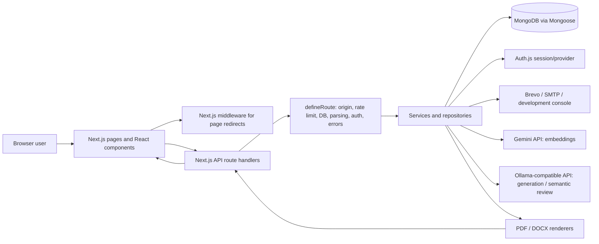
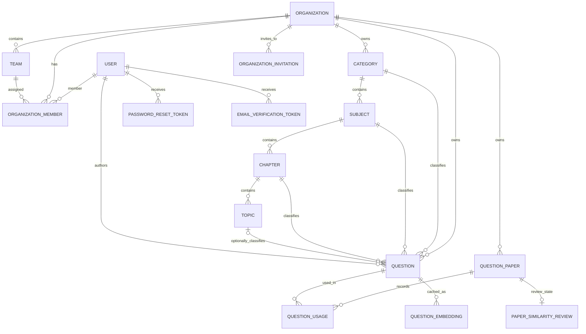
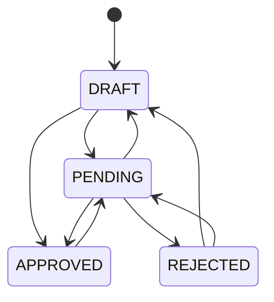
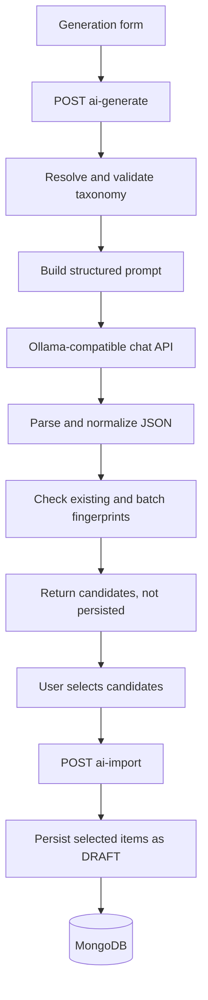
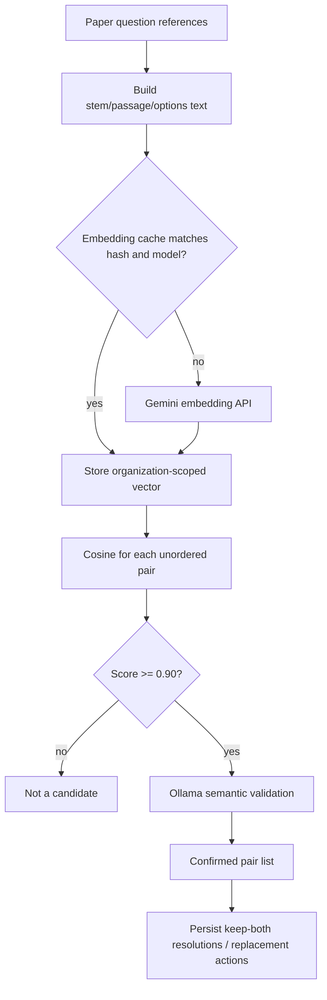
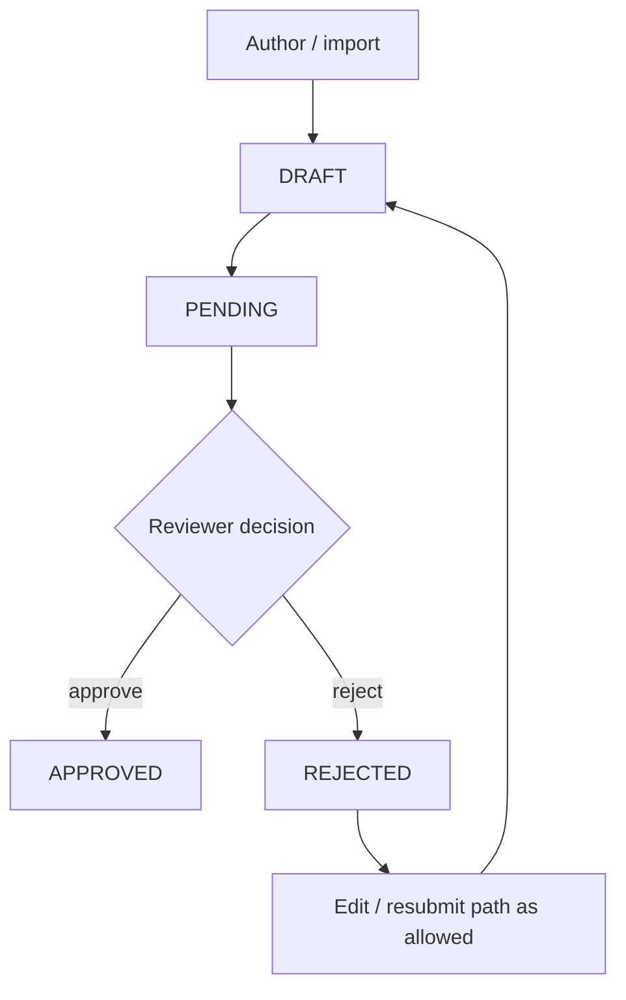
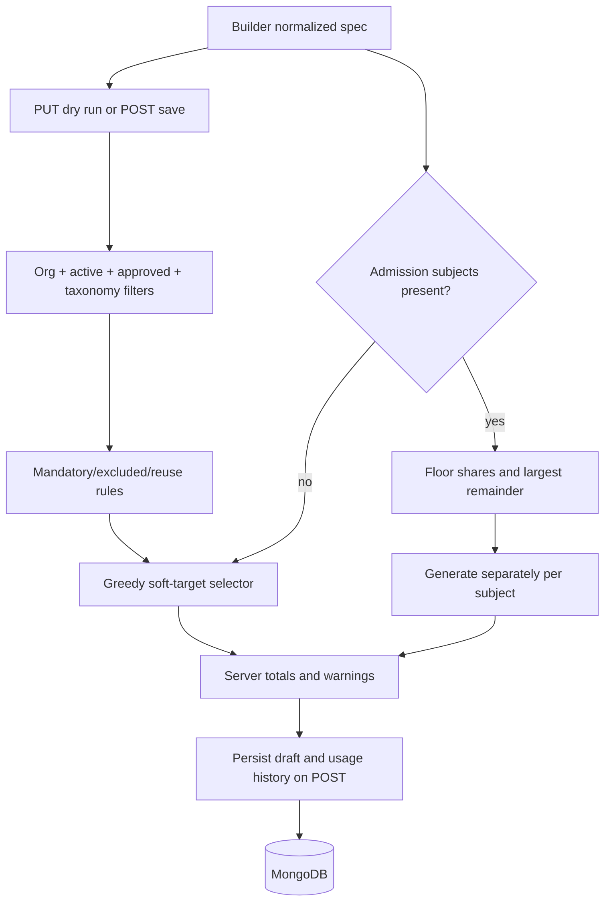
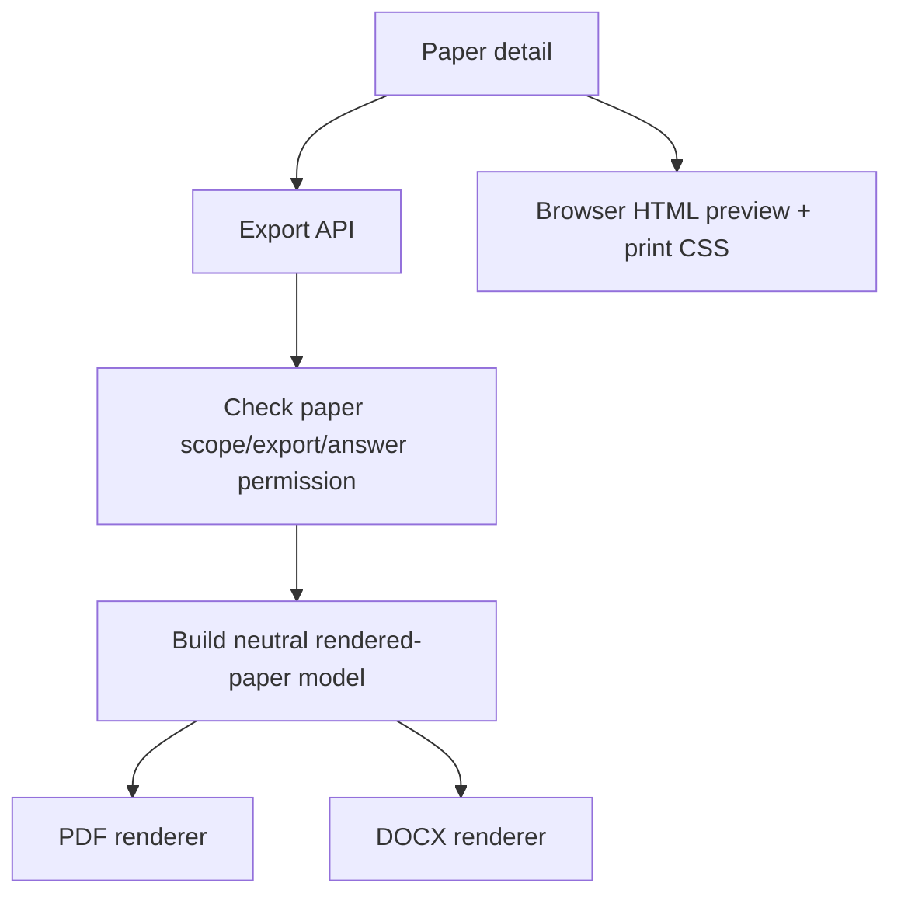

# AutoQgen Thesis Audit — Part 2: Technical Implementation Audit

**Scope:** Current repository source, including the existing Part 1 feature inventory, App Router pages and API handlers, shared API infrastructure, services, models, validation, authentication and authorization, AI and similarity code, export code, tests, scripts, and configuration.
**Baseline:** The Part 1 report identifies `main` at `b980a26`; the current worktree also contains the Part 1 documentation. No application code was changed for this audit.
**Method:** Read-only code inspection and route/model/test/configuration enumeration. Test suites were not executed for this audit.
**Artifact availability:** No separate artifact-generation facility was available. This Markdown report is the deliverable.

This report documents implementation evidenced by the current source, not the behavior of a live deployment. Secret values are intentionally excluded. Where source comments disagree with executable code, the executable path is described and the discrepancy is called out.

## 1. System Architecture

AutoQgen is a Next.js App Router application. React server/client components render public and authenticated pages. Client components call same-origin Next.js API routes. API handlers use a shared route wrapper for common request processing, then call domain services and Mongoose models/repositories. Services may additionally call Auth.js, Gemini-compatible APIs, an Ollama-compatible chat-completions API, email transports, or rate-limit stores.

### Implemented layers

| Layer | Implementation |
|---|---|
| Presentation | Next.js App Router pages/layouts, React 19 components, client-side forms/tables/previews and browser print styles. |
| API | Next.js route handlers under `src/app/api`; most application routes are constructed with `defineRoute` in `src/lib/api/handler.ts`. |
| Domain | Services and repositories in `src/lib/services` and `src/lib/repositories` implement accounts, organizations, taxonomy, questions, papers, imports, similarity, and exports. |
| Persistence | MongoDB accessed through Mongoose models in `src/models`; `connectDB` centralizes connection/reuse. |
| Authentication | Auth.js/NextAuth v4 JWT sessions, Credentials provider, and optional Google OAuth; session helpers reload the user record. |
| Authorization | Global role permissions plus a separate organization-member role matrix; route wrappers and service-level ownership/tenant checks enforce access. |
| AI | Question generation and semantic similarity validation use the Ollama-compatible chat-completions client; paper-question embeddings use Gemini. A Gemini JSON-generation helper also exists, but is not the active question-generation service path. |
| Export | A shared paper-content representation is rendered through separate server-side PDF and DOCX paths; browser printing is a third, HTML/CSS path. |
| Integrations | MongoDB, optional Google OAuth, optional Brevo/SMTP email, optional Upstash REST rate-limit store, Gemini API, and Ollama-compatible API. |



The diagram is a logical view: Auth.js has its own catch-all route and middleware reads the session token; not every request passes through every box. No standalone microservice boundary or separate backend deployment is present in the inspected project.

**Evidence:** `src/app/`, `src/components/`, `src/lib/api/handler.ts`, `src/lib/db/connect.ts`, `src/lib/services/`, `src/models/`, `src/middleware.ts`, `src/lib/ai/`, `src/lib/export/`.

## 2. Technology Stack

Versions below are declared versions/ranges from `package.json`, not independently verified deployed runtime versions. “Used” means source code imports or invokes the technology for an application/test function.

| Layer | Technology | Declared version | Purpose | Evidence / use |
|---|---|---:|---|---|
| Language | TypeScript | `^5.9.3` | Application, services, models, tests | `tsconfig.json`, `src/**/*.ts(x)` |
| Runtime | Node.js | `>=20.9.0` | Next server, scripts, server-side integrations | `package.json` engines |
| Web framework | Next.js | `16.2.3` | App Router, route handlers, middleware, server rendering | `src/app`, `src/middleware.ts` |
| UI | React / React DOM | `19.2.4` | Component rendering and interactions | `src/components`, `src/app` |
| Authentication | `next-auth` (Auth.js v4 package) | `^4.24.14` | Credentials/Google provider and JWT session | `src/lib/auth/options.ts`, `src/app/api/auth/[...nextauth]/route.ts` |
| Database driver/ODM | Mongoose | `^9.6.1` | MongoDB schema, model, query, index definitions | `src/models`, `src/lib/db/connect.ts` |
| Validation | Zod | `^3.25.76` | Environment, request and domain input validation | `src/lib/validation`, `src/lib/config/env.ts` |
| Password hashing | bcryptjs | `^3.0.2` | Password hashing and comparison | `src/lib/auth/password.ts`, `src/lib/auth/options.ts` |
| Styling | Tailwind CSS | `^4.1.14` | Utility styling and PostCSS integration | `src/app/globals.css`, PostCSS config |
| Icons | lucide-react | `^1.31.0` | UI icons | Component imports |
| Motion | framer-motion | `^13.1.0` | UI motion/transition components where imported | `src/components` |
| PDF | pdf-lib | `^1.17.1` | Server-side PDF document creation | `src/lib/export/pdf.ts` |
| PDF fonts | @pdf-lib/fontkit | `^1.1.1` | Font embedding for PDF rendering | `src/lib/export/pdf.ts`, `src/lib/export/fonts.ts` |
| DOCX | docx | `^9.5.1` | Server-side Word document creation | `src/lib/export/docx.ts` |
| Email | nodemailer | `^7.0.5` | SMTP transport | `src/lib/email` |
| Unit/integration tests | Vitest | `^3.2.4` | Node-environment test execution and coverage | `vitest.config.ts`, `tests/` |
| React test plugin | @vitejs/plugin-react | `^5.0.4` | Vitest JSX/React transformation | `vitest.config.ts` |
| Browser E2E | @playwright/test | `^1.56.0` | Browser authentication test | `playwright.config.ts`, `e2e/auth.spec.ts` |
| Test database | mongodb-memory-server | `^10.2.4` | Optional in-memory MongoDB for integration tests | `tests/integration/db.ts` |
| Build/lint | ESLint / eslint-config-next | `^9.38.0` / `16.2.3` | Static linting | `eslint.config.mjs`, package scripts |
| CSS build | @tailwindcss/postcss | `^4.1.14` | Tailwind CSS PostCSS plugin | PostCSS config |
| Script runner | tsx | `^4.20.6` | TypeScript scripts and seeds | `package.json` scripts |

No standalone ORM other than Mongoose, separate API server, or client-side PDF package was identified. Redis client support exists as an injectable store module but is not selected by the default store factory when only `REDIS_URL` is configured.

## 3. Project / Codebase Structure

| Directory/file | Responsibility |
|---|---|
| `src/app/` | Next App Router pages, route layouts, public pages, dashboards, admin screens, and API route tree. |
| `src/app/api/` | HTTP handlers. Current scan found 68 `route.ts` files; the list of handlers and methods is in Section 5. |
| `src/components/` | Reusable interface, question, organization, dashboard, paper, review, and form components. |
| `src/lib/api/` | Shared route factory, response envelope, pagination and taxonomy route factories. |
| `src/lib/auth/` | Auth.js configuration, user/session access, password operations, global/organization RBAC. |
| `src/lib/db/` | Mongoose connection lifecycle and model initialization. |
| `src/lib/models/` | No separate authoritative model layer was used for the current audit; active Mongoose schemas are under `src/models/`. |
| `src/models/` | 20 domain schema/model files plus `index.ts` export barrel. |
| `src/lib/repositories/` | Query/persistence adapters for domain areas such as taxonomy and users. |
| `src/lib/services/` | Business workflows and domain rules. |
| `src/lib/validation/` | Zod schemas for APIs and domain input, including auth, questions, paper generation/design, taxonomy, and templates. |
| `src/lib/ai/` | Prompt construction, LLM clients, generation parsers/normalizers. |
| `src/lib/similarity/` | Cosine scoring, thresholds, and semantic-validation prompt/configuration. |
| `src/lib/export/` | Shared paper document model, PDF/DOCX renderer and font handling. |
| `src/types/` | Shared TypeScript unions for roles, questions, papers, organizations, audit records. |
| `tests/unit/` | Unit tests for validation, RBAC, algorithms, components/utilities, imports, exports and errors. |
| `tests/integration/` | Service/API-oriented tests against MongoDB test setup. |
| `e2e/` | Playwright browser test(s). |
| `scripts/` | Seed/demo data, migration and maintenance scripts. |
| `docs/thesis-audit/` | Part 1 and Part 2 thesis-audit reports. |
| `package.json` | Scripts, dependencies, Node engine requirement. |
| `vitest.config.ts`, `playwright.config.ts` | Test discovery/runtime configuration. |
| `next.config.ts`, `eslint.config.mjs`, `tsconfig.json` | Framework, lint and TypeScript configuration. |

**Evidence:** `src/app`, `src/components`, `src/lib`, `src/models`, `src/types`, `tests`, `e2e`, `scripts`, project root configuration.

## 4. Request / Response Architecture

### Typical wrapped API request

```text
React component / browser
  -> fetch to same-origin /api path
  -> Next route handler created by defineRoute
  -> trusted-origin check for state-changing methods
  -> optional rate-limit policy
  -> MongoDB connection (unless route opts out)
  -> parse route params/query/body and apply configured Zod schemas
  -> require active account and configured platform/org permission
  -> route callback calls a service/repository
  -> Mongoose query/write and optional external integration
  -> standardized JSON response or normalized error
  -> client updates state / displays result
```

The order matters: the shared handler checks origin before rate limiting/database work. GET/HEAD/DELETE do not read a JSON body in the wrapper. Default body cap is 1 MiB. Routes can opt out of database setup or use direct handler logic; Auth.js and several binary/redirect routes are exceptions.

### Response contract

Success: `{ success: true, data, requestId, meta? }`; `meta` is pagination metadata when supplied. Failure: `{ success: false, error: { code, message, details? }, requestId }`. Responses include `x-request-id`. Binary avatar and export handlers, redirects, and some direct handlers have their own transport responses.

### Concrete workflow examples

**Question creation:** authenticated client submits validated data to `/api/questions`; route checks capability and delegates normalization, taxonomy/organization checks, fingerprinting and persistence to question services; service creates a draft unless an explicit permitted status transition applies; response returns the created record. Exact create-body schema is in `src/lib/validation/question.schema.ts`.

**AI generation:** UI posts generation parameters to `/api/questions/ai-generate`; server resolves/validates taxonomy placement and constructs provider prompt; Ollama-compatible call returns text; parser/normalizer checks candidate shape and duplicate fingerprints; candidates are returned, not automatically persisted. User-selected candidates are sent to `/api/questions/ai-import` and saved as drafts.

**Paper generation:** builder sends the normalized specification to `/api/papers/generate`; PUT computes a dry run and POST generates and persists a paper draft. Service filters approved active questions within organization, enforces mandatory/excluded constraints, chooses candidates, computes totals, and records question usage on successful save.

**Paper export:** authenticated request to `/api/papers/:id/export` resolves paper and permission, constructs the common rendered-paper data model, then routes to separate PDF or DOCX renderer. Browser print uses the HTML preview and CSS instead.

**Evidence:** `src/lib/api/handler.ts`, `src/lib/api/response.ts`, `src/lib/errors/handler.ts`, `src/lib/services/question.service.ts`, `src/lib/services/ai-question.service.ts`, `src/lib/services/paper-generator.service.ts`, `src/lib/services/paper-export.service.ts`.

## 5. Complete API Endpoint Audit

The current tree contains **68 API route files**, enumerated below. Methods are those exported by the route or a shared route factory. Authenticated routes may impose additional service-level ownership, organization membership, or permission rules. “Auth.js” refers to the provider’s own handler rather than `defineRoute`.

The common success envelope and validation pipeline are described in Sections 4 and 26. A route’s exact field-level schema should be taken from the referenced route and its imported schema; this table deliberately does not invent a combined API schema. `defineRoute` authorization is configured per handler, and some routes call org permission helpers within their callback.

| Method | Endpoint | Purpose / input-output shape | Authentication / authorization | Main source |
|---|---|---|---|---|
| GET, POST | `/api/auth/[...nextauth]` | Auth.js provider/session operations | Auth.js provider logic | `src/app/api/auth/[...nextauth]/route.ts`, `src/lib/auth/options.ts` |
| POST | `/api/auth/register` | Register account using auth registration schema; returns service result | Public; rate-limited; role assigned server-side | `src/app/api/auth/register/route.ts`, `auth.schema.ts`, `auth.service.ts` |
| POST | `/api/auth/forgot-password` | Request password-reset email; generic result | Public, rate-limited | `src/app/api/auth/forgot-password/route.ts`, `password-reset.service.ts` |
| POST | `/api/auth/reset-password` | Consume reset token and set new password | Public token flow, rate-limited, validated | `src/app/api/auth/reset-password/route.ts` |
| POST | `/api/auth/resend-verification` | Resend verification message | Public, rate-limited | `src/app/api/auth/resend-verification/route.ts` |
| GET | `/api/auth/verify-email` | Consume token and redirect to login with verification result | Public; direct redirect handler | `src/app/api/auth/verify-email/route.ts` |
| GET | `/api/health` | Liveness/readiness and DB status | Public; skips wrapper DB connect, then probes DB | `src/app/api/health/route.ts` |
| GET, POST | `/api/admin/organizations` | List/create organizations | Authenticated platform `organization:manage` | `src/app/api/admin/organizations/route.ts` |
| GET, PATCH | `/api/admin/organizations/:id` | Read/update organization | Authenticated platform `organization:manage` | `src/app/api/admin/organizations/[id]/route.ts` |
| GET | `/api/admin/organizations/:id/members` | List organization members | Authenticated platform admin | `src/app/api/admin/organizations/[id]/members/route.ts` |
| POST | `/api/admin/organizations/:id/owner` | Assign organization owner | Authenticated platform admin | `src/app/api/admin/organizations/[id]/owner/route.ts` |
| GET, PUT, POST | `/api/admin/settings` | Read/update platform settings; POST aliases PUT | Authenticated admin permission | `src/app/api/admin/settings/route.ts` |
| GET | `/api/admin/stats` | Platform administrative counts/statistics | Authenticated admin permission | `src/app/api/admin/stats/route.ts` |
| GET | `/api/admin/users` | Search/list platform users | Requires `user:read:any` | `src/app/api/admin/users/route.ts` |
| PATCH | `/api/admin/users/:id` | Update permitted user administration fields | Platform admin authorization | `src/app/api/admin/users/[id]/route.ts` |
| GET | `/api/audit` | Paginated audit-log listing | `audit:read` | `src/app/api/audit/route.ts`, `audit.service.ts` |
| GET, POST | `/api/boards` | List and create boards | Authenticated; taxonomy permissions | `src/app/api/boards/route.ts`, taxonomy route factory |
| GET, PUT, DELETE | `/api/boards/:id` | Read, update, deactivate board | Authenticated; taxonomy permissions | `src/app/api/boards/[id]/route.ts` |
| GET, POST | `/api/categories` | List/create taxonomy categories | Read uses taxonomy read permission; writes require configured taxonomy permission | `src/app/api/categories/route.ts`, `taxonomy-routes.ts` |
| GET, PUT, DELETE | `/api/categories/:id` | Read/update/deactivate category | Authenticated; taxonomy permissions | `src/app/api/categories/[id]/route.ts`, `taxonomy-routes.ts` |
| GET, POST | `/api/subjects` | List/create subjects | Authenticated; taxonomy permissions | `src/app/api/subjects/route.ts` |
| GET, PUT, DELETE | `/api/subjects/:id` | Read/update/deactivate subject | Authenticated; taxonomy permissions | `src/app/api/subjects/[id]/route.ts` |
| GET, POST | `/api/chapters` | List/create chapters | Authenticated; taxonomy permissions | `src/app/api/chapters/route.ts` |
| GET, PUT, DELETE | `/api/chapters/:id` | Read/update/deactivate chapter | Authenticated; taxonomy permissions | `src/app/api/chapters/[id]/route.ts` |
| GET, POST | `/api/topics` | List/create topics | Authenticated; taxonomy permissions | `src/app/api/topics/route.ts` |
| GET, PUT, DELETE | `/api/topics/:id` | Read/update/deactivate topic | Authenticated; taxonomy permissions | `src/app/api/topics/[id]/route.ts` |
| GET, POST | `/api/exams` | List/create exams | Authenticated; taxonomy permissions | `src/app/api/exams/route.ts` |
| GET, PUT, DELETE | `/api/exams/:id` | Read/update/deactivate exam | Authenticated; taxonomy permissions | `src/app/api/exams/[id]/route.ts` |
| GET | `/api/invitations` | List pending invitations addressed to current account email | Authenticated | `src/app/api/invitations/route.ts`, `invitation.service.ts` |
| POST | `/api/invitations/:id/accept` | Accept current-user invitation | Authenticated; service matches invitee identity | `src/app/api/invitations/[id]/accept/route.ts` |
| POST | `/api/invitations/:id/reject` | Reject current-user invitation | Authenticated; service matches invitee identity | `src/app/api/invitations/[id]/reject/route.ts` |
| GET, PATCH | `/api/organization` | Read/update current organization settings/details | Authenticated; org permission in route | `src/app/api/organization/route.ts` |
| POST | `/api/organization/switch` | Switch active organization context | Authenticated; verifies membership | `src/app/api/organization/switch/route.ts` |
| GET | `/api/organization/members` | List current organization members | Authenticated; members-read permission | `src/app/api/organization/members/route.ts` |
| PATCH, DELETE | `/api/organization/members/:id` | Change member role/status or remove member, per schema/action | Authenticated; org governance checks | `src/app/api/organization/members/[id]/route.ts` |
| GET, POST | `/api/organization/invitations` | List/create organization invitations | Authenticated; invitation governance checks | `src/app/api/organization/invitations/route.ts` |
| DELETE | `/api/organization/invitations/:id` | Cancel/delete organization invitation | Authenticated; org invitation-management checks | `src/app/api/organization/invitations/[id]/route.ts` |
| GET, POST | `/api/organization/teams` | List/create teams | Authenticated; org/team permissions | `src/app/api/organization/teams/route.ts` |
| PATCH, DELETE | `/api/organization/teams/:id` | Update/remove team | Authenticated; org/team permissions | `src/app/api/organization/teams/[id]/route.ts` |
| PATCH, DELETE | `/api/organization/teams/:id/members/:memberId` | Update team membership or remove member from team | Authenticated; team-scope permission enforced | `src/app/api/organization/teams/[id]/members/[memberId]/route.ts` |
| GET, POST | `/api/questions` | Query and create question records | Authenticated; question capability, org and ownership rules | `src/app/api/questions/route.ts`, `question.service.ts` |
| GET, PUT, DELETE | `/api/questions/:id` | Read, update, deactivate/delete question | Authenticated; question-level ownership/review checks | `src/app/api/questions/[id]/route.ts` |
| POST | `/api/questions/bulk` | Bulk question create/import operations | Authenticated; bulk-import capability and schema | `src/app/api/questions/bulk/route.ts` |
| POST | `/api/questions/bulk-review` | Batch approve/reject eligible questions | Authenticated; review permission | `src/app/api/questions/bulk-review/route.ts` |
| POST | `/api/questions/creative-group` | Create a linked four-part creative question group | Authenticated; question-create capability and group validation | `src/app/api/questions/creative-group/route.ts` |
| GET | `/api/questions/availability` | Count/availability query for paper-builder constraints | Authenticated; query schema; content scope | `src/app/api/questions/availability/route.ts` |
| POST | `/api/questions/ai-check` | Validate/check question content with AI-related workflow | Authenticated; route-specific question permission/schema | `src/app/api/questions/ai-check/route.ts` |
| POST | `/api/questions/ai-generate` | Generate question candidates | Authenticated; AI generation capability; validated placement and prompt input | `src/app/api/questions/ai-generate/route.ts`, `ai-question.service.ts` |
| POST | `/api/questions/ai-import` | Persist selected generated questions as drafts | Authenticated; question import/create capability | `src/app/api/questions/ai-import/route.ts` |
| POST | `/api/questions/ai-creative-generate` | Generate creative-question group candidates | Authenticated; generation capability and structure validation | `src/app/api/questions/ai-creative-generate/route.ts` |
| POST | `/api/questions/ai-creative-import` | Persist selected creative candidates | Authenticated; import/create capability | `src/app/api/questions/ai-creative-import/route.ts` |
| GET, POST | `/api/papers` | List/create or manually assemble papers | Authenticated; paper capability, org and ownership checks | `src/app/api/papers/route.ts`, `paper.service.ts` |
| PUT, POST | `/api/papers/generate` | PUT dry-run; POST persist generated draft | Authenticated; paper creation/generation permission | `src/app/api/papers/generate/route.ts`, `paper-generator.service.ts` |
| GET, PUT, DELETE | `/api/papers/:id` | Retrieve, update, deactivate/delete paper | Authenticated; ownership/organization and paper permission | `src/app/api/papers/[id]/route.ts` |
| POST | `/api/papers/:id/actions` | Lifecycle actions such as publish/archive/restore/clone | Authenticated; action-specific permission and validation | `src/app/api/papers/[id]/actions/route.ts` |
| PATCH | `/api/papers/:id/design` | Persist design configuration independently of question selection | Authenticated; paper update permission | `src/app/api/papers/[id]/design/route.ts` |
| POST | `/api/papers/:id/regenerate` | Regenerate a saved paper using stored configuration | Authenticated; paper ownership/update checks | `src/app/api/papers/[id]/regenerate/route.ts` |
| GET, POST | `/api/papers/:id/similarities` | Retrieve/recompute similarity review | Authenticated; paper access and review workflow permission | `src/app/api/papers/[id]/similarities/route.ts` |
| POST | `/api/papers/:id/similarities/keep` | Record a keep-both resolution for a flagged pair | Authenticated; paper access | `src/app/api/papers/[id]/similarities/keep/route.ts` |
| POST | `/api/papers/:id/similarities/replace` | Attempt to replace a similar question | Authenticated; paper update permission | `src/app/api/papers/[id]/similarities/replace/route.ts` |
| GET, POST | `/api/papers/:id/export` | Export student/teacher paper to PDF or DOCX; direct response is a file | Authenticated; export and answer-export checks | `src/app/api/papers/[id]/export/route.ts` |
| GET, POST | `/api/question-templates` | List/create reusable generation and design templates | Authenticated; template read/manage permission | `src/app/api/question-templates/route.ts` |
| GET, PUT, DELETE | `/api/question-templates/:id` | Read/update/deactivate template | Authenticated; template capability and org ownership | `src/app/api/question-templates/[id]/route.ts` |
| POST | `/api/question-templates/:id/duplicate` | Duplicate a reusable template | Authenticated; template manage permission | `src/app/api/question-templates/[id]/duplicate/route.ts` |
| GET, PUT | `/api/users/me` | Read/update current profile | Authenticated | `src/app/api/users/me/route.ts` |
| PUT | `/api/users/me/password` | Change current password | Authenticated; current-password and new-password validation | `src/app/api/users/me/password/route.ts` |
| GET | `/api/users/me/avatar` | Return current user avatar bytes or redirect to remote image | Authenticated direct handler | `src/app/api/users/me/avatar/route.ts` |
| GET | `/api/users/:id/avatar` | Return an avatar for an identified user | Direct route; inspect handler for access policy | `src/app/api/users/[id]/avatar/route.ts` |

**Inventory note:** The complete scan found 68 route files. A method-enumeration agent search initially counted only files with direct method syntax and missed shared-factory route exports; this report reconciles taxonomy and alias methods by inspecting the route files and `taxonomy-routes.ts`. The catch-all NextAuth handler is distinct from application routes.

## 6. API Workflow Details

### Shared route wrapper

For wrapped handlers, `defineRoute` obtains/request-propagates a request ID; checks trusted origin for state-changing methods; applies an optional named rate limit; connects to MongoDB unless `skipDb`; parses params/query/body with supplied schemas; authenticates if configured; checks the configured global or combined org permission; invokes the callback; normalizes errors; and logs request method/path/duration. `GET /api/health` opts out of initial DB connect, then deliberately probes and reports connection status.

### Question persistence and review

Question services validate that requested taxonomy references resolve in the appropriate organization, normalize data and calculate the stable content fingerprint, then persist question documents. Lists use filters and pagination. Review endpoints update status, reviewer metadata, and review note through service rules rather than trusting a client-side button. Bulk review applies the same eligibility/status checks to selected records.

### AI question workflow

The AI generation API returns normalized candidates without inserting them. The import API accepts selected candidate content and creates draft records. Creative generation adds the four-part structural contract and rechecks generated results; selected groups use the creative import/group persistence path.

### Paper generation and lifecycle

PUT `/api/papers/generate` computes a preview/dry-run result; POST saves. Saved papers are drafts. Actions route handles lifecycle action dispatch. Regeneration replaces the questions in the same paper; it is not versioned history. Similarity routes recompute pairs, retain keep-both resolutions, or attempt bounded replacement. Export handlers return file bytes rather than the ordinary JSON envelope.

**Evidence:** `src/lib/api/handler.ts`, `src/lib/services/question.service.ts`, `src/lib/services/ai-question.service.ts`, `src/lib/services/paper.service.ts`, `src/lib/services/paper-generator.service.ts`, `src/lib/services/paper-similarity.service.ts`, `src/lib/services/paper-export.service.ts`.

## 7. Database Architecture

MongoDB is the data store. The application uses Mongoose schemas/models rather than SQL, a relational ORM, or filesystem-backed persistence. `connectDB` maintains a cached connection/promise on `globalThis` to avoid opening a new connection for each request in a reused Node process. It uses connection options/pool limits, avoids Mongoose command buffering, and applies retry/backoff behavior after a failed connection. `MONGODB_DB_NAME` can select the database name; URI values are never reproduced here.

Schema indexes include unique keys, tenant-prefixed list indexes, text search, TTL expiration, and compound lookup indexes. Mongoose `populate`/references and ordinary queries implement relations. One admin statistic uses an aggregation pipeline. No transaction usage was found in inspected application TypeScript; this is a source-search finding, not proof that the deployed database never uses transactions externally.

**Evidence:** `src/lib/db/connect.ts`, `src/models/*.ts`, `src/lib/services/admin.service.ts` (aggregate path).

## 8. Complete Database Model Audit

There are 20 schema/model files and one `src/models/index.ts` barrel. All model schemas use Mongoose timestamps except where explicitly constrained below. Important schema fields and relations:

| Model | Purpose / significant fields | Relationships / constraints / consumers |
|---|---|---|
| `User` | name, normalized unique email, optional hidden password hash, image, global role/status, verification timestamp, organization pointer, `tokenVersion`, last login, timestamps | Organization pointer; referenced by memberships, content authorship, audit, invitations and tokens. Email unique; role/status indexed. Password excluded from default selects and JSON. |
| `Organization` | name, unique lowercase slug, nullable owner/creator, active flag | Owner/creator reference User; parent tenant for memberships/content. |
| `OrganizationMember` | userId, organizationId, role, status, optional teamId/inviter, joinedAt | Unique `(userId, organizationId)`; refs User, Organization, Team; organization+role/status/team indexes. |
| `OrganizationInvitation` | organization, normalized email, optional userId/teamId, org role, inviter, hashed token, status/expiry/accepted/rejected timestamps | One pending invite per `(organizationId,email)` via partial unique index; unique token hash; email/status and org/created indexes. |
| `Team` | organizationId, name, description, creator, active | Unique `(organizationId,name)`; org-scoped membership teamId. |
| `Category` | organizationId, name/slug/description/order/active/creator | Unique org+slug and org+name; parent of subject/chapter taxonomy. |
| `Subject` | organizationId, name/slug/code, category, classLevel, group, order, active, creator | Unique org+category+slug and name; category reference; parent for chapter. |
| `Chapter` | organizationId, name/slug/number/description, category, subject, order, active, creator | Unique org+subject+slug; refs category/subject; parent for topic/questions. |
| `Topic` | organizationId, name/slug/description, category, subject, chapter, order, active, creator | Unique org+chapter+slug; taxonomy references. |
| `Board` | name/slug/shortName/country/order/active/creator | Unique slug/name; question/paper board metadata. Not represented as tenant-owned in schema. |
| `Exam` | name/slug/type/category/board/year/session/description/order/active/creator | Type enum `SSC`, `HSC`, `ADMISSION`, `BCS`, `JOB`, `OTHER`; unique slug+year+board. |
| `Question` | organization and taxonomy refs; type/difficulty/language; polymorphic content/options/answer/explanation; hash; source/session/year/marks/time/tags; AI provenance; creative group fields; status/active; creator/reviewer metadata | References Organization, Category, Subject, Chapter, Topic, Board, Exam, User. Creative group is fields on question docs, not a separate model. Multiple tenant-prefixed query indexes and unique org+chapter+contentHash. |
| `QuestionPaper` | organization, title/description/instructions, category/subject/board/exam/year, mode/status, duration, totals, ordered sections/questions with marks snapshots, generation spec, previous-usage decision, design config, clonedFrom, authorship/lifecycle timestamps, active | Refs Organization, taxonomy, Question, User. Org-scoped list/search indexes; title text index. |
| `QuestionUsage` | questionId, organizationId, paperId, paperType, usedAt, creator | Refs Question/Organization/QuestionPaper/User; unique question+paper; usage history indexes. |
| `QuestionPatternTemplate` | organization, name/description, optional category/subject, Mixed generationSpec/designConfig, creators, active | Unique org+name; org/active/update index. Config is validated by Zod on write. |
| `QuestionEmbedding` | organization/question, sourceHash, embedding model, numeric vector and dimension | Cached Gemini embedding; unique org+question; cache invalidation compares model and sourceHash. |
| `PaperSimilarityReview` | organization/paper, threshold/model/signature, last count/check metadata, resolved pairs | One document per org+paper. Persists keep-both decisions and check metadata; flagged pairs recomputed. |
| `PasswordResetToken` | user, SHA-256 tokenHash, expiry, usedAt, optional request IP | Unique token hash; TTL on expiry; user/used/expiry lookup index. |
| `EmailVerificationToken` | user, hashed token, expiry, usedAt | Unique token hash and TTL expiry. |
| `AuditLog` | action, optional actor/role, resource type/id, metadata, request ID/IP, outcome, creation time | Actor references User; indexes for date/actor/action/resource; TTL after two years. |
| `SystemSetting` | key, siteName, default language, paper limits/default question count, registration/maintenance string flags, updatedAt | Unique key, global default document; stored settings are string-valued. |
| `index.ts` | Model and type export barrel | Not a database model. |

Selected schema details: question options/content/answer and paper question/section/generation-spec structures are embedded subdocuments (many have `_id: false`). Paper question marks are snapshotted at insertion while the Question reference remains. Mongoose indexes are declared in schema source; actual index creation/deployment state was not inspected.

**Evidence:** `src/models/`, especially `User.ts`, `OrganizationMember.ts`, `OrganizationInvitation.ts`, `Question.ts`, `QuestionPaper.ts`, `QuestionUsage.ts`, `QuestionPatternTemplate.ts`, `QuestionEmbedding.ts`, and `PaperSimilarityReview.ts`.

## 9. Database Relationships



The ER diagram represents explicit schema references and cardinalities conceptually; some arrays of IDs are embedded in paper generation specs, and no database-enforced foreign-key constraint is implied. Creative grouping links Question records with a string `creativeGroupId`, not a dedicated group document.

## 10. Authentication Architecture

- Provider integration is Auth.js/NextAuth v4 with JWT sessions, Credentials, and Google OAuth enabled only when both Google credential variables are configured.
- Credentials authorization normalizes email, applies an IP-based login rate limit, fetches the hidden password hash, compares with bcrypt, checks account status and email verification, and updates `lastLoginAt`. Unknown-user checks use a dummy bcrypt comparison.
- Google login requires provider-verified email. New users receive the application default role; provider role claims are not trusted.
- JWT lifetime is seven days with daily update age. Session helpers reload user role/status/organization information from MongoDB. Middleware uses identity for page redirects; it excludes `/api/*`, whose handlers enforce API access.
- Registration assigns `DEFAULT_ROLE` (`member`), issues email verification except in development, and does not accept a client-selected role.
- Passwords use bcryptjs cost 12. Policy requires 12–72 characters, lower/upper case, number and special character, rejects edge whitespace and common phrases.
- Password reset creates 32 random bytes, stores only SHA-256 token hash, expires in one hour and consumes single-use tokens; reset updates the MongoDB User and sends a password-changed notification.
- Email verification tokens are hashed, prior tokens are invalidated when reissued, and successful tokens are consumed.
- Logout is session sign-out through Auth.js. There is no separate database session collection; JWT is the session mechanism.

**Important observed issue:** `tokenVersion` is incremented on password change/reset and copied into the JWT, while comments describe invalidation, but the inspected callback/session guard does not compare JWT tokenVersion with the current database tokenVersion. Thus password changes are not shown to revoke pre-existing JWT sessions through this mechanism.

**Evidence:** `src/lib/auth/options.ts`, `session.ts`, `password.ts`, `src/lib/services/auth.service.ts`, `password-reset.service.ts`, `email-verification.service.ts`, `src/middleware.ts`, `src/models/User.ts`.

## 11. Authorization and RBAC

### Global roles

`User.role` supports `super_admin`, `organization_owner`, `team_admin`, `teacher`, `content_writer`, `reviewer`, `moderator`, `student`, and `member`. This permission matrix is platform-wide:

| Role | Implemented global capability summary |
|---|---|
| `member` | No global platform content permissions; can still authenticate, manage own account/profile, and respond to invitations. |
| `student` | Taxonomy read and question read. |
| `content_writer` | Student capabilities plus read answers, create/generate/import questions, edit/delete own questions, create/read/update-own/delete-own papers, export papers, read templates. |
| `teacher` | Content-writer capabilities plus answer-inclusive paper export. |
| `reviewer` | Teacher capabilities plus edit any question, review questions, and update any paper. |
| `moderator` | Reviewer capabilities plus delete any question, taxonomy create/update, delete any paper, publish papers, and manage templates. |
| `team_admin` | Moderator capabilities plus bulk question import and taxonomy delete. Does not automatically get platform-wide user administration, audit, or organization management. |
| `organization_owner` | Same global content capability list as team_admin; organization governance is granted separately through membership role. |
| `super_admin` | All global permissions, including platform user, audit, and organization management. |

### Organization roles

The organization role belongs to an `(user, organization)` membership. Roles are `organization_owner`, `team_admin`, `teacher`, `content_writer`, `reviewer`, `moderator`, `student`, and `member`; `super_admin` is not assignable as an organization role.

- Organization owner has the organization governance matrix, including member/invitation/role/team governance and content capabilities.
- Team admin has team-scoped team management and specified content/review capabilities; team-bound checks must enforce own-team restrictions.
- Teacher, content writer, reviewer and moderator receive progressively different content capabilities. Reviewer includes review and update-any; moderator includes wider deletion/taxonomy/paper/template powers, but org governance remains separately controlled.
- Student and member receive baseline organization content capabilities configured in `org-rbac.ts` (question read, paper create, template read, taxonomy read); governance permissions are not granted by ordinary membership.

### Enforcement locations and limits

- `defineRoute` can require an authenticated active user and configured global or global-or-org permission.
- Org APIs call `assertPermissionOrOrgMembership`, membership resolution, or team-scope helpers.
- Services and repositories apply owner/organization identifiers to content queries; UI permission gating is supplemental and is not the security boundary.
- Middleware protects selected page paths but explicitly excludes API paths.
- Not every route is wrapped: Auth.js, verification redirect, avatar handlers and file responses require per-handler inspection.
- A membership granting a content capability is distinct from filtering records; current content models and services also carry/use `organizationId`.

**Evidence:** `src/types/roles.ts`, `src/types/organization.ts`, `src/lib/auth/rbac.ts`, `org-rbac.ts`, `org-session.ts`, `session.ts`, `src/lib/api/handler.ts`, organization and admin API route files.

## 12. Multi-Tenant / Organization Data Isolation

An ordinary account’s current organization is resolved from active membership context rather than taking a client-supplied arbitrary organization ID as authority. The helper can resolve the active membership and fallback membership; the platform super-admin flow supports a valid override. Organization switch verifies membership and changes active context.

Questions, papers, taxonomy resources, templates, teams, embeddings, question usage, invitations, and similarity review records store organization references. Major content services/repositories include organization filters when reading or writing. Unique indexes commonly include organization ID, preventing names or fingerprints from colliding across tenants.

The organization layer provides membership, organization role, team context, invitations, governance, content capability, and content ownership. `User.organization` is a pointer and does not itself represent the many-to-many membership source of truth.

**Discrepancy against stale comments:** `org-rbac.ts` and parts of `org-session.ts` contain comments claiming the content models do not carry organization IDs and membership only unlocks capabilities. Current models/services do carry and filter by tenant ID. The code path, not the stale comment, is documented here.

**Needs verification:** This source review did not test every deployed service call path against two live tenants or inspect production Mongo indexes. Tenant isolation is an implementation intent evidenced by query filters/indexes, not a deployment-level penetration-test conclusion.

## 13. Question Management Implementation

The `Question` Mongoose schema stores tenant/taxonomy references and content as embedded subdocuments. Types include options, matching pairs, content and answers; question type and difficulty/language/status are constrained by TypeScript/Zod/Mongoose unions/enums. It includes marks, estimate time, source/session/year, tags, `aiGenerated`, review fields, and creative group metadata.

Create/edit/list/review/import operations are implemented through question API handlers and `question.service.ts`. List filters are schema-driven, paginated and use organization-scoped indexes; `$text` is used for text search. Create validates parent taxonomy placement and org ownership; content hashes support database-level duplicate prevention. Delete is generally represented as deactivation in the service/model, rather than hard deletion, subject to route flow.

Statuses are `DRAFT`, `PENDING`, `APPROVED`, `REJECTED`. Approval/rejection stores reviewer, timestamp, and note. Paper generation hard-filters to active approved records. Existing approved-question content can be read with answer visibility controlled by permission.

**Evidence:** `src/models/Question.ts`, `src/lib/services/question.service.ts`, `src/lib/validation/question.schema.ts`, `src/app/api/questions/`, `src/app/dashboard/questions/`.

## 14. AI Question Generation Architecture

### Input, prompt, model, and response

The generation flow accepts curriculum placement and generation settings through a Zod request schema. The server resolves and validates taxonomy names/IDs and builds a prompt in `src/lib/ai/question-prompt.ts`. The active production-service path calls the Ollama-compatible OpenAI-style chat completions client using generation-specific model/URL/key configuration. A Gemini JSON-generation helper is present but is not the service used by this active question-generation path.

The model is instructed to return structured JSON. The application parses provider output and runs `normaliseAiReply`, checking supported question type/shape, answer/options consistency, placeholder or duplicate options and fill-in-the-blank structure. Creative generation applies group-shape and quality checks, can retry up to three generation/quality attempts, and uses a separate LLM review prompt.

### Persistence, errors and configuration

Normal AI generation returns candidates in memory; it does not directly insert them. Candidate fingerprints are checked against existing org content and batch duplicates. User selection/import persists selected questions as drafts through AI import endpoints. Creative groups persist as four ordered Question documents after group validation.

Provider failures, timeouts and malformed JSON are surfaced through application errors rather than treated as successful empty generations. AI-related route availability depends on credentials/configuration.

Relevant environment-variable names are `OLLAMA_QUESTION_GENERATION_API_KEY`, `OLLAMA_QUESTION_GENERATION_MODEL`, `OLLAMA_QUESTION_GENERATION_API_URL`; creative/validation chat calls also use `OLLAMA_API_KEY`/`OLLAMA_MODEL` according to their client path. `GEMINI_API_KEY` is used for embedding and the separate Gemini helper. No values are reported.

**Evidence:** `src/lib/ai/question-prompt.ts`, `question-normalise.ts`, `question-generation-ollama.ts`, `ollama.ts`, `gemini.ts`, `src/lib/services/ai-question.service.ts`, AI route handlers, `src/lib/config/env.ts`.

## 15. AI Provider Architecture

| Provider/integration | Model source | Purpose | Client / use |
|---|---|---|---|
| Ollama-compatible chat completions | `OLLAMA_QUESTION_GENERATION_MODEL` and URL/key for the active generation client | Standard question generation | `question-generation-ollama.ts`, `ai-question.service.ts` |
| Ollama-compatible chat completions | `OLLAMA_MODEL` | Creative quality review and similarity semantic validation, as wired in clients | `ollama.ts`, `paper-similarity.service.ts` |
| Google Gemini API | `GEMINI_MODEL` | JSON generation helper is implemented, but is not the active standard question-generation service path | `gemini.ts` |
| Google Gemini API embeddings | `GEMINI_EMBEDDING_MODEL` | Embeddings for within-paper candidate similarity | `gemini.ts`, `paper-similarity.service.ts` |

Code comments in similarity configuration describe Gemini as final validator in places; executable implementation invokes `ollamaClient.validateSimilarity`. Embeddings are Gemini; semantic decision is Ollama. No model-quality or performance benchmark was found in this audit.

## 16. Embedding and Similarity Detection

The system checks similarities among questions within a paper. It builds an embedding source from question stem, passage and (for option-based questions) option text, capped at 8,000 characters. Existing embeddings are cached by organization/question and reused only if both `sourceHash` and model match. Gemini embedding calls are batched (up to 100 inputs).

For each unordered pair, cosine similarity is computed:

```text
cosine_similarity(A,B) = (A · B) / (||A|| ||B||)
```

All unique pairs are compared; threshold is `0.90`. Candidates meeting the threshold are ordered by score and sent for semantic validation through Ollama. A pair is flagged only if semantic validator says similar. The user-facing percent is rounded cosine similarity, not the model’s confidence. Keep-both is stored as a resolved hash-pair. Replacement attempts up to three candidate questions and swaps only after checking against remaining questions; failure leaves the paper unchanged.

**Evidence:** `src/lib/services/paper-similarity.service.ts`, `src/lib/similarity/cosine.ts`, `src/lib/similarity/config.ts`, `src/lib/ai/gemini.ts`, `src/lib/ai/ollama.ts`, `src/models/QuestionEmbedding.ts`, `PaperSimilarityReview.ts`.

## 17. Creative Question Technical Implementation

Creative questions are not stored in an independent current CreativeQuestion model. They use ordinary Question documents with shared `creativeGroupId`, `creativePartOrder`, Bengali part labels (`ক`, `খ`, `গ`, `ঘ`), shared stimulus and cognitive-level metadata.

The create/import path validates a complete four-member group, contiguous part order and expected labels; records are connected through the shared group key. The implementation attempts cleanup if partial group insertion fails. Group-aware service behavior controls retrieval/review and paper selection so the parts remain ordered as a unit. AI generation applies structural and quality validation and import creates the selected four parts as drafts. Group status handling coordinates the members.

**Evidence:** `src/models/Question.ts`, `src/lib/services/question.service.ts`, `src/lib/services/ai-question.service.ts`, `/api/questions/creative-group`, `/api/questions/ai-creative-generate`, `/api/questions/ai-creative-import`, `src/components/questions/`.

## 18. Question Review and Approval Workflow

Implemented question states: `DRAFT`, `PENDING`, `APPROVED`, and `REJECTED`. New user-authored/imported/AI-imported questions are normally drafts; submission/review actions are governed by service transitions and role permissions. Reviewer-capable roles can approve or reject, including bulk actions; review metadata includes reviewer ID, approval timestamp and review note. Paper eligibility explicitly requires `APPROVED` and active status.



The diagram follows the transition table in `src/types/question.ts`; the service enforces these transitions along with permission checks.

**Evidence:** `src/types/question.ts`, `src/lib/services/question-status.ts`, `src/lib/services/question.service.ts`, `src/app/api/questions/bulk-review/route.ts`, `src/app/dashboard/review/`.

## 19. Question Import System

The question import interface accepts CSV and JSON data. CSV parsing handles quoted values, escaped quotes, commas and line breaks within quotes, CRLF/LF and UTF-8 BOM. JSON input may be an array or an object with a `questions` array. UI mapping supplies taxonomy placement; parser preview reports malformed rows/mapping issues. Requests are sent sequentially in batches (up to 500 rows), with progress/per-row error display.

Server import schemas and service normalize/validate each question, verify taxonomy and organization relationships, calculate duplicate fingerprints, and persist accepted rows as drafts. Bulk APIs enforce bulk-import capability. AI import is a separate path but also persists candidates as drafts.

**Evidence:** `src/lib/import/`, `src/lib/validation/`, `src/lib/services/question.service.ts`, `src/app/dashboard/questions/import/`, `/api/questions/bulk`, `/api/questions/ai-import`, related unit/integration tests.

## 20. Paper Builder Architecture

Paper builder offers manual question selection and automatic generation. Inputs include paper metadata/type, category/subject, chapters and optional taxonomy filters, total questions/marks, difficulty/type/chapter targets, mandatory/excluded questions, reuse policy, randomization options, and optional design/template settings. The builder checks availability and sends the same normalized generation spec for dry run and save.

The generator hard-filters the eligible pool to organization-owned, active, approved questions matching the selected constraints; mandatory/excluded and previous-use policies are applied. It greedily ranks remaining eligible questions using soft difficulty/type/chapter preferences. Marks totals are recalculated server-side. Generated papers are saved as `AUTO` drafts with generation spec, design, question order and per-paper marks snapshots.

Manual paper creation validates org/ownership, approved-active status, same subject, duplicate question IDs, and complete ordered creative groups. Saved configuration can be regenerated; regeneration replaces selected questions on the same document, preserving title/design, and is not revision history. Templates bundle generation spec plus design configuration and are copied into builder local state on load.

Paper states are `DRAFT`, `PUBLISHED`, `ARCHIVED`; clone creates a new draft. Sections are optional; no sections renders a flat list.

**Evidence:** `src/components/papers/PaperBuilder.tsx`, `GenerateTab.tsx`, `src/lib/services/paper-generator.service.ts`, `paper.service.ts`, `src/models/QuestionPaper.ts`, `src/models/QuestionPatternTemplate.ts`, paper API routes.

## 21. Admission-Based Paper Implementation

Admission mode supports multiple selected subjects, each with a whole-number percentage; schema requires unique subjects and percentages totaling 100%. Each subject’s initial requested question count is `floor(totalQuestions × percentage / 100)`. Remaining questions are allocated by descending fractional remainder (largest remainder method; stable order breaks tied remainders). Each subject is generated separately using its allowed chapters and spec.

Difficulty/type/chapter targets can be proportionally scaled to per-subject allocation with floor plus largest-remainder rounding. The system does not transfer an infeasible subject allocation to another subject; an infeasible allocation errors. Mandatory questions are checked against selected subject/allocation. Availability is therefore considered under each subject’s actual filtered pool, not just the aggregate number across all subjects.

Percentages determine question counts, not guaranteed marks distribution. The paper then uses shared paper persistence, preview and export workflows.

**Evidence:** `src/lib/validation/paper.schema.ts`, `src/lib/services/paper-generator.service.ts`, `src/components/papers/GenerateTab.tsx`, paper model/schema and tests.

## 22. Paper Preview and Template System

Paper detail/preview components render paper questions and design state in the browser. The saved paper supplies question order/content and design configuration; the current UI can send unsaved design state to PDF export. The design panel updates design separately (`PATCH /api/papers/:id/design`) without regenerating questions.

PDF and DOCX do not share the same layout renderer. They share a neutral rendered paper-content representation; the PDF renderer consumes supported layout fields including page size/orientation, margins, columns, font settings, numbering, header/layout, watermark and two-copies-per-page. DOCX uses a separate implementation with fixed paragraph/table formatting and a hard-coded Bengali font name, and does not apply PDF design settings. Browser print uses the rendered HTML preview with print CSS.

Student/teacher variant controls answer inclusion; a user’s answer-export permission is checked server-side. Missing Unicode font support is reported as degraded PDF export with a UI warning.

**Evidence:** `src/components/papers/PaperDetail.tsx`, `PaperPreview.tsx`, `src/app/globals.css`, `src/lib/export/paper-document.ts`, `pdf.ts`, `docx.ts`, `paper-export.service.ts`, export route.

## 23. PDF / Export Architecture

PDF generation is server-side using `pdf-lib` and fontkit. DOCX generation is server-side using `docx`. Export route selects the requested format and student/teacher variant, loads paper data, checks export/answer permissions, creates a normalized document representation and returns a file response with download metadata. PDF renderer lays out pages and embeds configured fonts when available; missing font support is exposed as degraded output rather than silently claimed as fully rendered. DOCX formatting is independently implemented.

Print is a browser action on the preview (`window.print()`) with print styles, not a call to the PDF renderer. Thus PDF, DOCX, and print share source paper/question content but are not visually equivalent renderers. Tests cover student/teacher content variants and document paths; execution was not performed here.

**Evidence:** `src/app/api/papers/[id]/export/route.ts`, `src/lib/services/paper-export.service.ts`, `src/lib/export/{paper-document,pdf,docx,fonts}.ts`, `src/components/papers/PaperDetail.tsx`.

## 24. Dashboard / Analytics Implementation

The application contains user dashboard, platform admin dashboard, organization/member screens and review/paper counts. Admin statistics are computed from MongoDB queries and include at least an aggregation path for role counts; dashboards obtain data from API endpoints/services rather than calculating all counts solely in browser code. Content counts use active tenant or platform filters according to service context.

No evidence was found for a separate analytics warehouse, event pipeline, predictive analytics, or metrics collection service. Exact formulas vary by dashboard query; the report does not infer measures from chart names.

**Evidence:** `src/app/dashboard/page.tsx`, `src/app/admin/page.tsx`, `src/app/api/admin/stats/route.ts`, `src/lib/services/admin.service.ts`, dashboard components.

## 25. Validation Architecture

- **Client:** React forms perform interactive required-field/format checks and display server-side field issues; client checks are not the authority.
- **API:** Zod schemas are passed to `defineRoute` for params/query/body where configured. `parseWith` uses `safeParse` and returns structured field issues on failure.
- **Domain rules:** Services validate organization/taxonomy consistency, ownership, status transitions, duplicate IDs, creative group completeness, question eligibility, paper allocation and totals.
- **Database:** Mongoose required fields, enum/min/max/default constraints and unique/compound indexes add persistence-level validation. Mongo indexes are declared but deployed index state was not inspected.
- **Provider output:** AI responses are parsed and normalized; malformed or structurally invalid output is rejected/retried, not directly saved as a question.

**Evidence:** `src/lib/api/handler.ts`, `src/lib/validation/`, `src/lib/services/`, `src/models/`.

## 26. Error Handling Architecture

`AppError` and related error types carry stable codes, HTTP status and optional field issues. `toErrorResponse` maps expected validation/auth/permission/not-found/conflict/rate-limit/provider errors to standardized failure envelopes and logs internal exceptions server-side. Shared API handlers attach request IDs and log request completion. UI form/toast components present API messages and validation fields.

AI timeout/provider/malformed-response errors surface as explicit availability/service failures. Import can report per-row failures. PDF font degradation is surfaced as response metadata/header and UI warning. Direct avatar routes return direct HTTP statuses; verification returns a redirect; file export returns a binary response, so these do not all use the JSON envelope.

The handler does not establish a general retry policy for all failed routes. Retry behavior is feature-specific (e.g. creative generation quality attempts and similarity replacement attempts).

**Evidence:** `src/lib/errors/`, `src/lib/api/handler.ts`, `response.ts`, AI services, import services, export route.

## 27. Security Implementation

Concrete mechanisms observed:

- Auth.js credential/OAuth authentication, JWT session, active/suspended and email-verification checks.
- bcrypt password hashes with cost 12; password field excluded by default from reads and JSON serialization.
- Hashed high-entropy reset/verification/invitation tokens; expiry/single-use patterns where implemented.
- Zod request and environment validation; 1 MiB default body cap in shared route wrapper.
- Trusted-origin check on state-changing wrapped API routes; named rate limits; optional Upstash shared store.
- Server-side platform, organization, team-scope, ownership and tenant query checks in routes/services.
- Environment secrets centralized through `src/lib/config/env.ts`; secret values are not logged by the environment loader.
- Audit events for supported sensitive operations; request IDs and structured logging.
- `next.config.ts` sets browser security headers; exact headers should be read there for deployment documentation.

Boundaries/qualifications:

- Middleware intentionally excludes API paths, so API handlers/services are the enforcement layer.
- Default memory rate-limit storage is process-local; only Upstash REST is selected by default when configured. `REDIS_URL` alone is not wired into the default store.
- Requests lacking Origin/Referer/Sec-Fetch-Site are accepted as non-browser requests by origin policy; origin checking is not authentication.
- `tokenVersion` session invalidation mismatch is described in Section 10.
- Source inspection is not a security certification or live deployment test.

**Evidence:** `src/lib/security/`, `src/lib/rate-limit/`, `src/lib/auth/`, `src/lib/config/env.ts`, `src/middleware.ts`, `next.config.ts`, API routes and services.

## 28. Environment Configuration

Required means required by the typed application environment schema in a normal server runtime, not necessarily every test/tool execution. `NEXTAUTH_URL` may be derived from Vercel variables. Names only; secret values and connection strings are excluded.

| Variable | Purpose | Required? | Used by |
|---|---|---|---|
| `NODE_ENV` | Environment selection | Defaulted | env config, middleware, scripts |
| `MONGODB_URI` | MongoDB connection | Yes | `env.ts`, DB connect |
| `MONGODB_DB_NAME` | Optional DB name override | No | DB connect |
| `NEXTAUTH_SECRET` | Auth.js JWT signing/encryption | Yes | Auth.js, middleware |
| `NEXTAUTH_URL` | Canonical auth/application URL | Yes; can derive from Vercel URL | Auth.js, env validation |
| `VERCEL_URL`, `VERCEL_PROJECT_PRODUCTION_URL` | Derive canonical URL / trusted deployment origin | No | env config |
| `GOOGLE_CLIENT_ID`, `GOOGLE_CLIENT_SECRET` | Enable Google OAuth as a pair | Optional, paired | Auth.js |
| `LOG_LEVEL` | Structured logger threshold | Defaulted | logger |
| `AUTH_DEBUG_RESET_URL` | Development/reset diagnostic behavior toggle | Defaulted | auth/reset flow |
| `SMTP_HOST`, `SMTP_PORT`, `SMTP_SECURE`, `SMTP_USER`, `SMTP_PASSWORD` | SMTP mail transport | Optional; credentials paired | email transport |
| `EMAIL_FROM`, `EMAIL_SUPPORT` | Sender/support address | Default/optional | email service |
| `BREVO_API_KEY`, `BREVO_SENDER_EMAIL`, `BREVO_SENDER_NAME` | Brevo mail transport; configured as a complete set | Optional | email service |
| `ALLOWED_ORIGINS` | Additional trusted origins | Optional | origin security |
| `UPSTASH_REDIS_REST_URL`, `UPSTASH_REDIS_REST_TOKEN` | Shared REST rate limit store | Optional, paired | rate-limit factory |
| `REDIS_URL` | Redis URL declared in env and injectable Redis store | Optional; not selected by default factory alone | config / optional store module |
| `SIGNUP_REQUEST_LIMIT`, `SIGNUP_REQUEST_WINDOW_SECONDS`, `SIGNUP_SUCCESS_LIMIT`, `SIGNUP_SUCCESS_WINDOW_SECONDS` | Signup rate-limit settings | Defaulted | rate-limit policy |
| `GEMINI_API_KEY` | Gemini API credential | Optional based on embedding/helper use | Gemini client |
| `GEMINI_MODEL` | Gemini JSON helper model | Defaulted | `gemini.ts` |
| `GEMINI_EMBEDDING_MODEL` | Embedding model | Defaulted | similarity embedding |
| `OLLAMA_API_KEY`, `OLLAMA_MODEL` | Ollama-compatible chat validation model | Optional/defaulted | Ollama client |
| `OLLAMA_QUESTION_GENERATION_API_KEY`, `OLLAMA_QUESTION_GENERATION_MODEL`, `OLLAMA_QUESTION_GENERATION_API_URL` | Active question-generation endpoint configuration | Optional/defaulted | generation Ollama client |
| `PORT`, `E2E_BASE_URL`, `CI` | E2E server/test behavior | Tool-specific | Playwright config |
| `SEED_PASSWORD` | Optional seed/E2E password override | Tool-specific | seed scripts, E2E |
| `USE_MEMORY_MONGO` | Select integration test DB behavior | Tool-specific | `tests/integration/db.ts` |
| `NEXT_PHASE` | Production build-phase validation exception | Framework-set | `env.ts` |

Email transport selection is Brevo, then SMTP, then development console; production with no transport logs an error and cannot deliver. No actual configured values were inspected for this report.

## 29. Testing Architecture

Vitest uses Node environment, `tests/setup.ts`, and discovers `tests/**/*.test.{ts,tsx}`. V8 coverage is configured for relevant source/model paths. Integration tests use configured or memory MongoDB setup, with some suites able to skip when a database is not available. Playwright configuration runs browser E2E against a configured or locally started server.

| Test area | Test files | What it verifies (from test names/source) |
|---|---|---|
| Admin | `tests/unit/admin.test.ts`; `tests/integration/admin-user-organization.test.ts` | Admin service and user/org administration behavior. |
| AI generation | `tests/unit/ai-question.test.ts`; `tests/integration/ai-question-generation.test.ts` | Prompt/output normalization and AI question workflow. |
| Imports | `tests/unit/csv-import.test.ts`; `tests/integration/bulk-import-org-isolation.test.ts` | CSV parsing and organization-scoped bulk import. |
| Organization / isolation | `tests/unit/org-rbac.test.ts`; `tests/integration/organization-service.test.ts`, `member-org-content-access.test.ts`, `review-queue-org-isolation.test.ts` | Org permissions, organization management, content access and review scope. |
| Questions/review/status | `tests/unit/question-service.test.ts`, `question-status.test.ts`; `tests/integration/question-service.test.ts` | Question service and status transitions. |
| Paper generation / schema | `tests/unit/paper-generator.test.ts`, `paper-schema.test.ts`; `tests/integration/smart-generation.test.ts`, `question-availability.test.ts` | Generator constraints, schema rules and availability. |
| Paper lifecycle/usage | `tests/integration/paper-service.test.ts`, `paper-regeneration.test.ts`, `previous-question-usage.test.ts` | Paper persistence, regeneration and reuse tracking. |
| Similarity | `tests/unit/similarity.test.ts`; `tests/integration/paper-similarity.test.ts` | Cosine/threshold and similarity review/replacement workflows. |
| Export/document | `tests/unit/paper-document.test.ts` | Shared rendered content, PDF/DOCX variants. |
| Templates | `tests/unit/question-template-schema.test.ts`; `tests/integration/question-template.test.ts` | Template schemas and persistence. |
| Auth/password/email | `tests/unit/auth-options.test.ts`, `email.test.ts`; `tests/integration/password-reset.test.ts` | Auth provider configuration, email and reset behavior. |
| Security/API utilities | `tests/unit/origin.test.ts`, `rate-limit.test.ts`, `security.test.ts`, `errors.test.ts`, `validation.test.ts`, `pagination.test.ts` | Origin/rate-limit/security/error/validation/pagination utilities. |
| UI utility | `tests/unit/toast.test.ts` | Toast behavior. |
| Browser E2E | `e2e/auth.spec.ts` | Browser login flow. |

**Test execution status:** Test files and scripts were inspected; no test command was run during this audit. Test existence verified from source; execution result not verified during this audit.

Current source scan found **21 unit test files, 15 integration test files, and one E2E spec**.

## 30. Important Algorithms and Business Logic

| Logic | Purpose / input → processing → output | Source |
|---|---|---|
| Content fingerprint | Text and chapter ID → Unicode NFKC, lowercase, whitespace collapse/trim → SHA-256 of `chapterId::normalizedText` used for dedupe | `src/lib/security/hash.ts`, question service |
| Similarity candidate score | Question input → Gemini embedding vector → cosine `dot/(norms)` for every unique pair → sorted candidate scores | `paper-similarity.service.ts`, `similarity/cosine.ts` |
| Semantic pair decision | Pairs with cosine `>= 0.90` → batched Ollama validation → only confirmed similar pairs flagged | similarity service, `ollama.ts` |
| Greedy paper selection | Eligible approved questions + marginal targets → each candidate receives difficulty/type/chapter bucket weights; score 3/2/2 respectively, preference for prior-use adds 1.5 and over-limit penalty is 100; optional jitter → greedily select until requested count | `paper-generator.service.ts` |
| Admission allocation | Subject percentages and total count → floor each exact share → largest-remainder distribute leftover → generate within each subject independently | `paper-generator.service.ts`, paper schema |
| Random ordering | Selected item list → Fisher–Yates shuffle if order randomization enabled → persisted/rendered order | `paper-generator.service.ts` |
| Creative grouping | Four question docs with same group ID and ordered part labels → completeness/order validation → grouped presentation/selection | question service, Question schema |
| Previous-question usage | Paper/question references, organization and use date → indexed usage history applies exclude/allow/prefer policy and recent-paper restriction | `question-usage.service.ts`, generator |
| Permission resolution | Global role permission matrix plus org membership role matrix/current org/team scope → capability allow/deny | `rbac.ts`, `org-rbac.ts`, `org-session.ts` |

The generator’s difficulty/type/chapter targets are preferences, not hard joint quotas. `buildSlotPlan` creates a proportional display/test plan and is not the selector algorithm. Requested total marks are checked/reported after selection; marks mismatch does not itself make the pool infeasible. A generated seed is recorded, but selection uses `Math.random()` and is not reproducible from that seed. `randomize.options` is carried in configuration but is not applied by the generator.

## 31. Data Flow Diagrams

### AI question generation and selected import



### Similarity review



### Question review



### Paper generation and admission allocation



### Export



## 32. Technical Dependency Map

| Feature | UI | API | Service/logic | Model | External service |
|---|---|---|---|---|---|
| Authentication | Login/register/reset screens | Auth.js and auth routes | auth/password/email services | User and token models | Google OAuth, email |
| Organizations | Dashboard organization screens | `/api/organization*`, admin routes | org/member/invitation/team services | Organization, OrganizationMember, Invitation, Team | Email |
| Taxonomy | Category/subject/chapter/topic/board/exam screens | `/api/{categories,subjects,chapters,topics,boards,exams}` | taxonomy service/repository | taxonomy models | None |
| Questions | Question bank, forms, review, import | `/api/questions*` | question and import services | Question | Ollama for AI |
| AI generation | AI question screens | `/api/questions/ai-*` | AI question service, prompt/normalizer | Question on import | Ollama-compatible API |
| Question review | Review queue | question and bulk-review routes | question status/service | Question | None |
| Creative questions | Creative authoring/generation UI | creative group and AI creative routes | AI/question service | Four linked Question docs | Ollama-compatible API |
| Paper builder | PaperBuilder, GenerateTab | `/api/papers`, generate, availability | paper and generator services | QuestionPaper, QuestionUsage | None |
| Admission papers | Builder subject-allocation controls | generate route | admission quota branch | QuestionPaper, QuestionUsage | None |
| Similarity review | Paper similarity page | similarities/keep/replace routes | paper similarity service | QuestionEmbedding, PaperSimilarityReview | Gemini embeddings + Ollama validation |
| Paper templates | Template screens | `/api/question-templates*` | template service | QuestionPatternTemplate | None |
| Export | Paper detail/download controls | `/api/papers/:id/export` | paper export/document renderers | QuestionPaper, Question | None |
| Audit/admin | Admin/audit screens | `/api/admin*`, `/api/audit` | admin/audit services | User, Organization, AuditLog, SystemSetting | None |

## 33. Feature-to-Code Mapping

| Feature | Main UI/file | API | Service/logic | Database model | Status |
|---|---|---|---|---|---|
| Login/OAuth/session | `src/app/(auth)/login/page.tsx` | `/api/auth/[...nextauth]` | `auth/options.ts`, `session.ts` | User | Implemented |
| Registration and verification | register/verify screens | `/api/auth/register`, resend, verify | auth and email-verification services | User, EmailVerificationToken | Implemented |
| Password recovery/change | forgot/reset/settings UI | forgot/reset, `/users/me/password` | password-reset/auth services | PasswordResetToken, User | Implemented |
| Admin users/organizations/settings | `src/app/admin/` | `/api/admin/*` | admin services | User, Organization, SystemSetting | Implemented |
| Organization membership/team/invites | `src/app/dashboard/organization/` | `/api/organization/*`, `/api/invitations` | organization/invitation services | Organization, OrganizationMember, Invitation, Team | Implemented |
| Taxonomy | dashboard category/subject/chapter/topic/board/exam screens | taxonomy route family | taxonomy service/repository | Category, Subject, Chapter, Topic, Board, Exam | Implemented |
| Question bank/authoring | dashboard questions list/new/edit | `/api/questions`, `/api/questions/:id` | `question.service.ts` | Question | Implemented |
| Question import | `src/app/dashboard/questions/import/page.tsx` | `/api/questions/bulk` | CSV/JSON import + question service | Question | Implemented |
| AI question generation | dashboard AI page | `/api/questions/ai-generate`, `/ai-import` | `ai-question.service.ts`, prompt/normalizer | Question on import | Implemented |
| Creative question groups | question/AI components | creative-group, AI creative routes | question/AI service | Question fields/group ID | Implemented |
| Review/approval | `src/app/dashboard/review/page.tsx` | question route, `/bulk-review` | question status/service | Question | Implemented |
| Similarity/dedupe | question import/check, paper similarity UI | `/api/questions/ai-check`, paper similarity routes | hashing and paper-similarity service | Question, QuestionEmbedding, review state | Implemented, with provider-comment discrepancy |
| Paper builder/manual papers | `src/components/papers/` | `/api/papers`, availability | paper service | QuestionPaper | Implemented |
| Admission distribution | `GenerateTab.tsx` | `/api/papers/generate` | admission allocator | QuestionPaper | Implemented |
| Templates | dashboard/templates screens | `/api/question-templates*` | template service | QuestionPatternTemplate | Implemented |
| Paper preview/design | paper detail/preview | design and paper routes | shared document preparation | QuestionPaper | Implemented |
| PDF/DOCX/print | PaperDetail controls | export route / browser print | PDF/DOCX renderers / CSS | QuestionPaper | Implemented, render paths differ |
| Dashboard and analytics | dashboard/admin screens | dashboard/admin APIs | admin/dashboard queries | Multiple | Implemented, query-specific |
| Audit log | admin audit screen | `/api/audit` | audit service | AuditLog | Implemented |

Every mapped feature above has a current source path in the corresponding section. This is not a statement that all UI affordances are available to every role.

## 34. Technical Issues / Inconsistencies

### Confirmed from source

1. **JWT `tokenVersion` is not compared to the database value in the inspected session-validation path.** Password operations increment it, but the intended invalidation does not occur through that comparison.
2. **`REDIS_URL` alone does not enable the Redis rate-limit store.** The default factory selects Upstash REST when both Upstash variables are configured, otherwise process-local memory. The Redis store is injectable but not wired as a default from `REDIS_URL`.
3. **In-memory rate limits are process-local.** Separate instances do not share counters unless the shared Upstash option is used.
4. **Similarity comments/config naming are stale.** Code embeds using Gemini and calls Ollama for final semantic validation.
5. **Organization RBAC comments are stale.** They state content data has no `organizationId`, while current models and service queries do use tenant IDs.
6. **Question fingerprint comment claims punctuation-insensitivity at edges, but executable normalization does not strip punctuation.** Actual normalization is NFKC, lowercasing, whitespace collapse and trim, then SHA-256.
7. **Paper generation distributions are soft greedy targets.** They do not guarantee exact joint counts; marks mismatch is a warning; `buildSlotPlan` is not the selector.
8. **Stored generation seed does not reproduce output.** Random choices use `Math.random`; `randomize.options` is not applied by the generator.
9. **DOCX ignores PDF design settings.** The two export renderers share content representation, not layout behavior. Browser print is separate too.
10. **`User` Mongoose default role is `teacher`, while self-registration explicitly assigns `DEFAULT_ROLE` (`member`).** Registration path overrides the schema default; other creation paths should be read individually.
11. **Some paths bypass shared `defineRoute`.** Auth.js, email-verification redirect and avatar routes have distinct error/auth/response behavior.

### Needs verification

- Whether production MongoDB indexes are fully built and match schema declarations.
- Whether all deployment/proxy origin headers and auth callback URLs match the assumed public origin setup.
- Whether email provider settings and delivery are configured successfully in the deployment.
- Whether every individual call-site retains an organization identifier under unusual or migrated data conditions; this audit inspected representative major services, not live multi-tenant penetration scenarios.
- Whether API route response details not enumerated in this report are stable contracts across deployments; exact route schemas and service responses remain the source for endpoint-level documentation.
- The globally shared Board/Exam schemas have no `organizationId`; whether their intentional global scope matches product policy should be confirmed.

## 35. Final Technical System Summary

AutoQgen is a TypeScript/Next.js 16 and React 19 application using MongoDB through Mongoose. Next App Router pages and client components call same-application API routes. Most routes use a shared wrapper for trusted-origin checks, rate limits, MongoDB setup, Zod parsing, authentication/permissions, normalized errors, and request logging.

Authentication is Auth.js JWT with Credentials and optional Google OAuth. Passwords are bcrypt-hashed; verification and password-reset tokens are stored hashed with expiration. Global account permissions and per-organization membership permissions are separate systems. Organization context and organization IDs scope the core content, papers, taxonomy, and related data.

Questions are polymorphic Question documents linked to curriculum taxonomy and carry review status and audit fields. Creative question groups are four linked Question rows. AI question generation uses an Ollama-compatible endpoint and returns normalized candidates for user-selected draft import. Paper similarity caches Gemini embeddings, compares cosine scores at a 0.90 candidate threshold, and asks Ollama for semantic confirmation.

Paper generation selects only eligible approved active content and uses a greedy selector with soft target distributions. Admission allocation uses percentage-based largest remainders and generates each subject independently. Papers can be manually assembled, generated, designed, reviewed for duplicates, cloned, published/archived, and exported. PDF, DOCX and browser print are distinct layout paths. Unit, integration and browser test suites exist, but their execution result was not verified during this audit.

Security controls in source include server-side authorization, tenant/ownership filtering, input schemas, password hashing, token hashing/expiry, rate limits, trusted-origin checks and response/error normalization. Noted implementation qualifications include ineffective tokenVersion revocation, process-local default rate limits, stale provider/RBAC comments, and render-path differences.

## 36. Thesis-Relevant Technical Material

| Potential artifact/topic | Why it may be useful |
|---|---|
| Layered system architecture diagram | Shows how the Next UI, API wrapper, domain services, database and external providers interact. |
| Entity-relationship diagram | Explains users, tenant memberships, taxonomy, questions, papers, usage, embeddings and review state. |
| API request sequence diagrams | Useful for showing common validation/auth/service/error pipeline and differences for direct binary/auth handlers. |
| RBAC matrices | Demonstrates global and organization roles, team scoping, and separation between governance and content capability. |
| Tenant-scoping data-flow diagram | Makes organization context resolution and organization-filtered queries visible. |
| AI question-generation pipeline | Documents prompt inputs, provider, JSON parsing, normalization, duplicate check and explicit user import/persistence point. |
| Similarity algorithm specification | Supports discussion of embedding input, cache invalidation, cosine threshold, LLM validation and user review decision. |
| Paper-generation algorithm | Describes hard eligibility constraints, greedy soft quotas, randomization and resulting warnings. |
| Admission allocation algorithm | Shows percentage validation and largest-remainder count allocation with no cross-subject fallback. |
| Creative-question data design | Explains a group represented by four ordered question documents rather than a separate aggregate model. |
| Review state diagram | Communicates draft/submission/review/approval and rejection paths. |
| Export pipeline comparison | Clarifies shared content preparation versus distinct PDF, DOCX and browser print layouts. |
| Database index/query map | Connects tenant-scoped query patterns, uniqueness rules, TTLs and search to schema design. |
| Validation and error sequence | Shows Zod boundary validation, business checks, database constraints and normalized error responses. |
| Test strategy map | Relates unit, Mongo-backed integration and Playwright E2E tests to implemented subsystems; actual test results must be run separately. |
